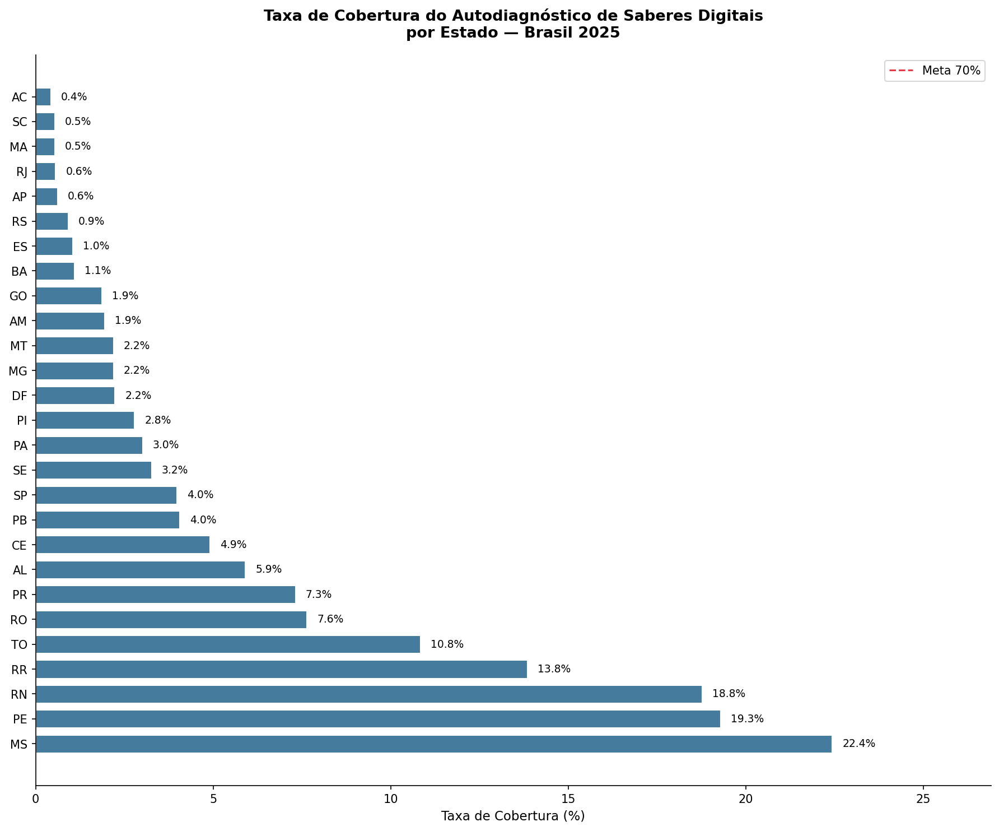
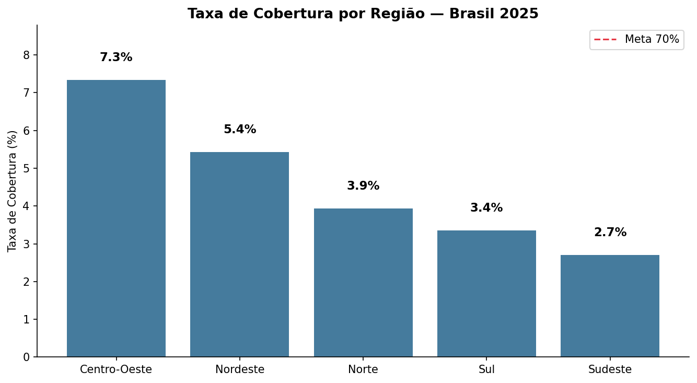
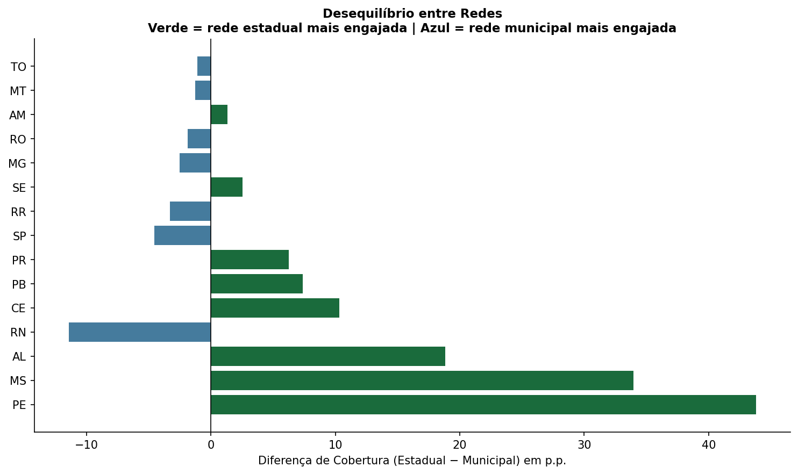

## Contexto

A Política Nacional de Educação Digital (Lei nº 14.533/2023) estabelece como estratégia prioritária a promoção de ferramentas de autodiagnóstico de competências digitais para profissionais da educação. Em resposta, o Ministério da Educação disponibilizou o **Autodiagnóstico de Saberes Digitais Docentes** na plataforma AVAMEC — um questionário de 17 perguntas distribuídas em três dimensões: Ensino e Aprendizagem, Cidadania Digital e Desenvolvimento Profissional.

O MEC só libera o relatório detalhado (com dados individuais por professor) quando **70% dos docentes de uma rede** respondem ao questionário. Essa condição torna o monitoramento do engajamento uma questão estratégica para secretarias de educação e parceiros técnicos.

## Problema

Nenhum painel público consolida a taxa de cobertura real por estado — ou seja, **quantos professores já responderam em relação ao total de docentes da rede**. As secretarias só conseguem ver o número bruto de respostas, sem o denominador.

## Metodologia

Os dados foram coletados diretamente da **API pública do AVAMEC** via webscraping — a mesma API que alimenta o painel oficial. Os endpoints foram identificados por inspeção das requisições HTTP no DevTools do navegador (engenharia reversa de API web), técnica que permite automatizar o que o painel faz manualmente.

Os IDs dos estados foram validados consultando o endpoint `/estado/lista` da própria API, garantindo que cada estado fosse consultado com o identificador correto.

Para calcular a **taxa de cobertura real**, os dados do AVAMEC foram cruzados com o **Censo Escolar 2025 (INEP)**, combinando a `Tabela_Escola_2025` (localização e dependência administrativa) com a `Tabela_Docente_2025` (quantidade de docentes por escola) pelo código de entidade (`CO_ENTIDADE`).

::: {.callout-note}
**Nota metodológica:** O denominador utilizado é a soma de `QT_DOC_BAS` por escola — mesma metodologia adotada pelo INEP em seus relatórios públicos. Esse indicador contabiliza vínculos docentes, não professores únicos, podendo superestimar levemente o total. A taxa de cobertura real é, portanto, uma estimativa conservadora.
:::

**Fontes:**

- API pública AVAMEC: `avamec.mec.gov.br/ava-mec-ws/sistema`
- Censo Escolar 2025: [dados.gov.br/inep](https://www.gov.br/inep/pt-br/acesso-a-informacao/dados-abertos/microdados/censo-escolar)

## Resultados

### Nenhum estado atingiu a meta de 70%

A taxa de cobertura nacional é de aproximadamente **4%** — o Brasil coletou cerca de 94 mil respostas de um universo estimado de 2,3 milhões de vínculos docentes na educação básica pública.



**MS lidera com 22,4%** — resultado expressivo considerando o contexto nacional, mas ainda distante dos 70% necessários para liberar o relatório detalhado. PE (19,3%) e RN (18,8%) surpreendem positivamente para o Nordeste.

O **Sudeste é a região com menor cobertura (2,7%)**, resultado paradoxal dado o tamanho e os recursos das redes de SP, RJ e MG. Isso sugere que o engajamento depende mais de mobilização ativa das secretarias do que de capacidade institucional.



### Mapa interativo de cobertura

```{=html}
<iframe src="mapa_cobertura.html" width="100%" height="550px" frameborder="0" style="border-radius:8px;"></iframe>
```

### Engajamento vem da rede estadual — com exceções



Na maioria dos estados onde o engajamento é mais alto, ele é liderado pela **secretaria estadual** — PE (+45 p.p.) e MS (+35 p.p.) são os exemplos mais expressivos. Isso indica que a mobilização top-down da secretaria estadual é o principal vetor de adesão.

**RN é a exceção mais interessante:** é o único estado com a rede municipal significativamente mais engajada que a estadual (-12 p.p.), sugerindo uma dinâmica de mobilização vinda dos municípios, não do estado.

### Composição de respostas por rede

```{=html}
<iframe src="composicao_redes.html" width="100%" height="700px" frameborder="0" style="border-radius:8px;"></iframe>
```

### Cobertura estadual × municipal

```{=html}
<iframe src="scatter_redes.html" width="100%" height="600px" frameborder="0" style="border-radius:8px;"></iframe>
```

### Concentração geográfica

Em estados como DF (100%) e GO (79%), quase todas as respostas vêm dos 10% de municípios mais ativos. MS é o estado mais distribuído (43%), com engajamento espalhado pelos seus 79 municípios.

```{=html}
<iframe src="concentracao_municipios.html" width="100%" height="450px" frameborder="0" style="border-radius:8px;"></iframe>
```

## Conclusões

1. **O Brasil está muito longe da meta:** com 4% de cobertura nacional, nenhum estado está próximo de liberar o relatório detalhado do MEC.

2. **Mobilização institucional importa mais que capacidade:** o Sudeste, região mais rica, tem a menor cobertura. MS e PE, com mobilização ativa das secretarias estaduais, lideram.

3. **A rede municipal é invisível na maioria dos estados:** a participação municipal é baixa em quase todos os estados, exceto RN e SP — lacuna importante dado que a rede municipal responde por grande parte dos docentes brasileiros.

4. **Monitoramento contínuo é viável:** a API pública do AVAMEC permite coleta automatizada e periódica. Com snapshots mensais, é possível acompanhar a velocidade de engajamento e projetar quando cada estado atingirá a meta.

## Código

Os notebooks estão disponíveis no [GitHub](https://github.com/beatrizlobato/portfolio-dados-educacao):

- `01_coleta.ipynb` — coleta nacional via API AVAMEC
- `02_mapa_engajamento.ipynb` — taxa de cobertura por estado e região
- `03_desigualdade_redes.ipynb` — comparação entre redes estadual e municipal
