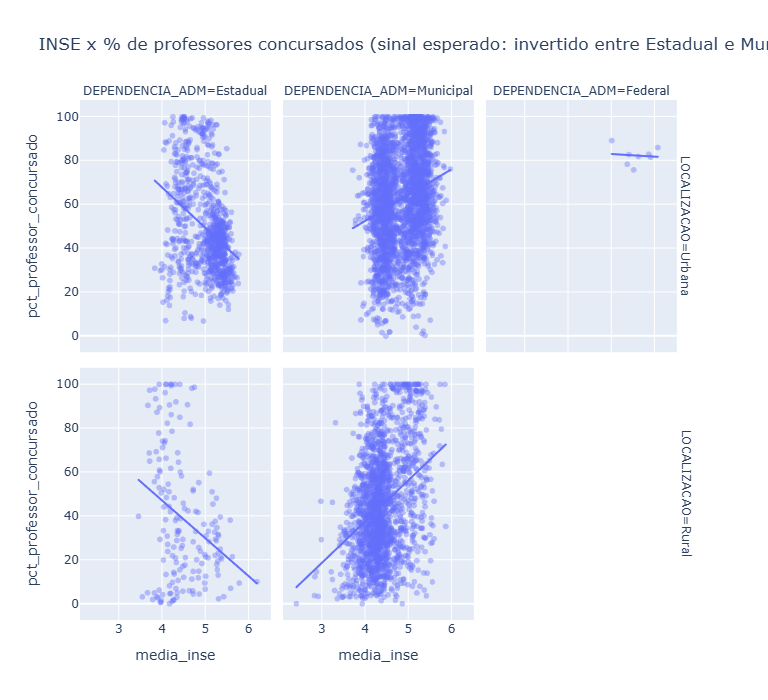
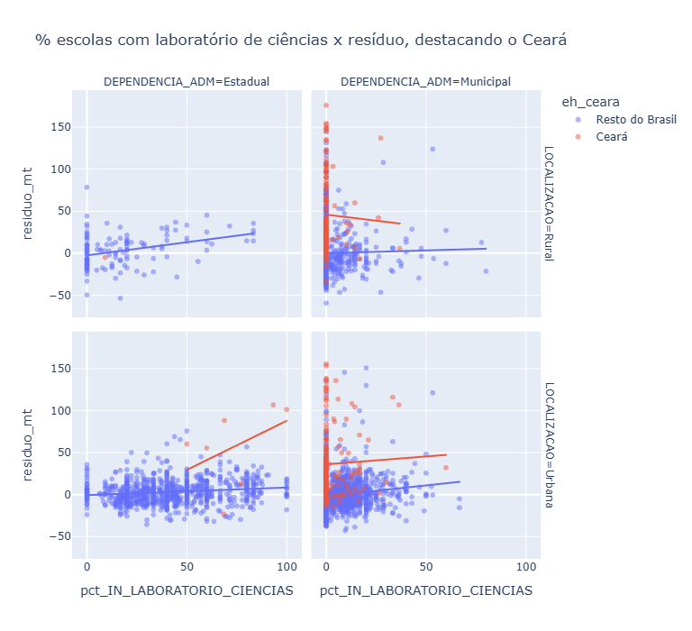
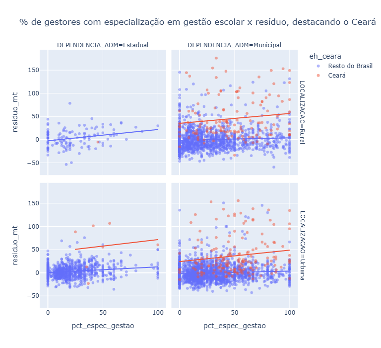

## Quem foge do previsto pelo nível socioeconômico?

Cruzando o Saeb 2025, o Censo Escolar 2025 e o INSE 2023 (Indicador de Nível Socioeconômico), calculei o resíduo de cada município/rede — a diferença entre a proficiência observada e a proficiência esperada dado seu nível socioeconômico. O Ceará domina a lista de municípios que mais superam o esperado, em quase toda rede e localização analisada.

## O enigma do vínculo docente

Antes de investigar o Ceará, um sinal intrigante apareceu na paisagem geral: a proporção de professores concursados correlaciona negativamente com proficiência e com nível socioeconômico na rede Estadual, mas positivamente na Municipal — um sinal invertido entre redes que não se explica pelo tamanho da rede.

## O que explica o Ceará?

Tempo integral explica parte do padrão, mas não os casos mais extremos. Numa varredura sistemática por todos os indicadores disponíveis, o que mais distingue os municípios cearenses é infraestrutura escolar e, principalmente, gestores com especialização em gestão escolar — o dobro do resto do país.

## O achado que generaliza

Testando se a especialização em gestão do gestor se sustenta além do Ceará — nos quatro estratos de rede e localização do país inteiro, e replicado tanto em Matemática quanto em Língua Portuguesa — foi o único indicador que se manteve forte em todas as combinações. Infraestrutura ajuda bastante, mas concentra o efeito na rede estadual; especialização em gestão escolar aparece de forma consistente em todo lugar.

## Limitações

Análise ecológica (município/rede, não aluno) e correlacional — não estabelece causalidade. O INSE é de 2023, com dois anos de defasagem em relação ao Saeb e ao Censo Escolar de 2025.
