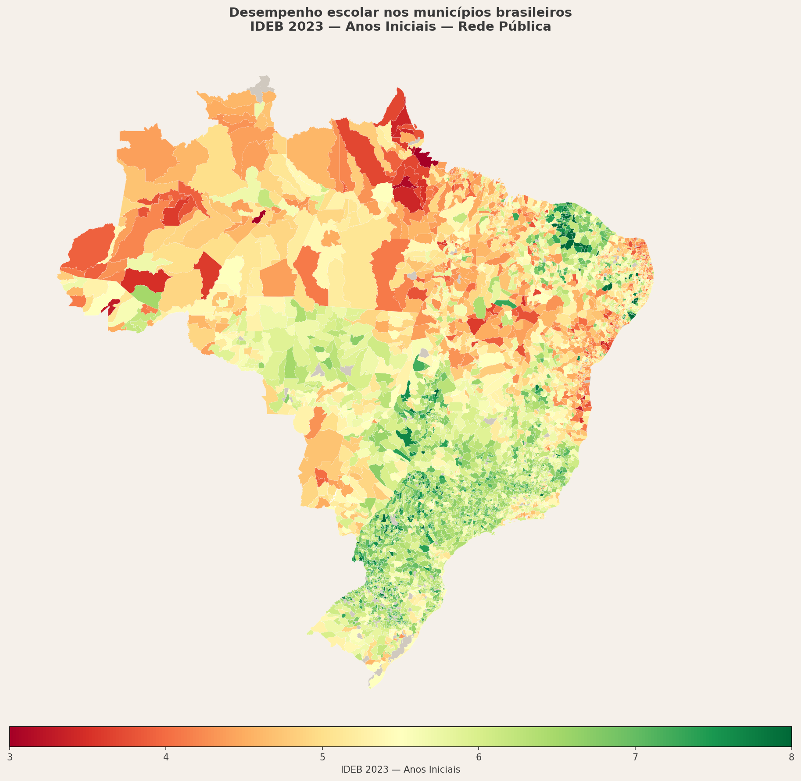
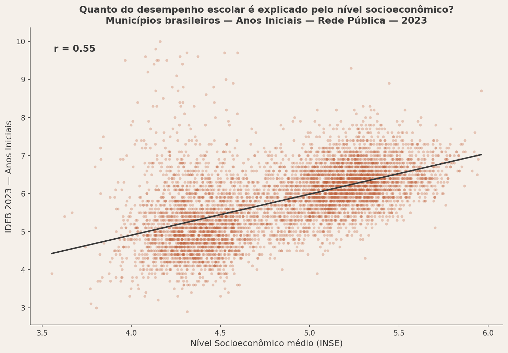
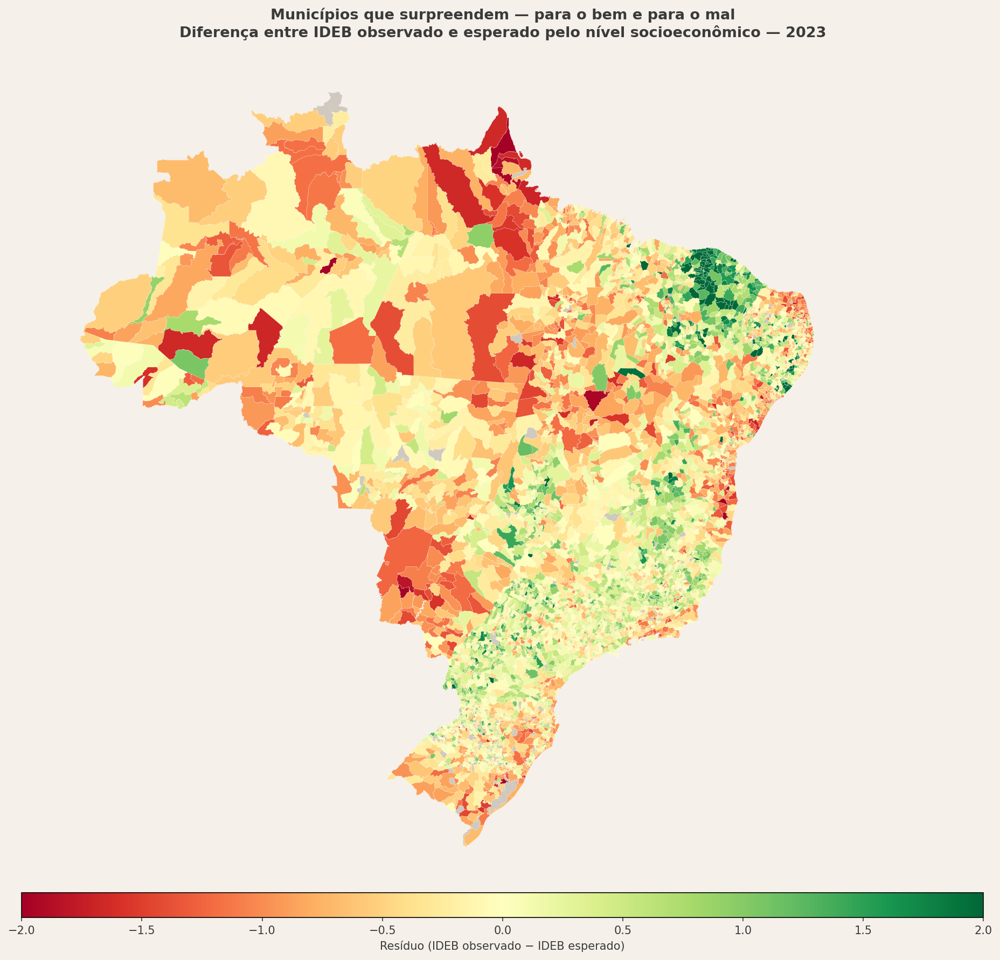
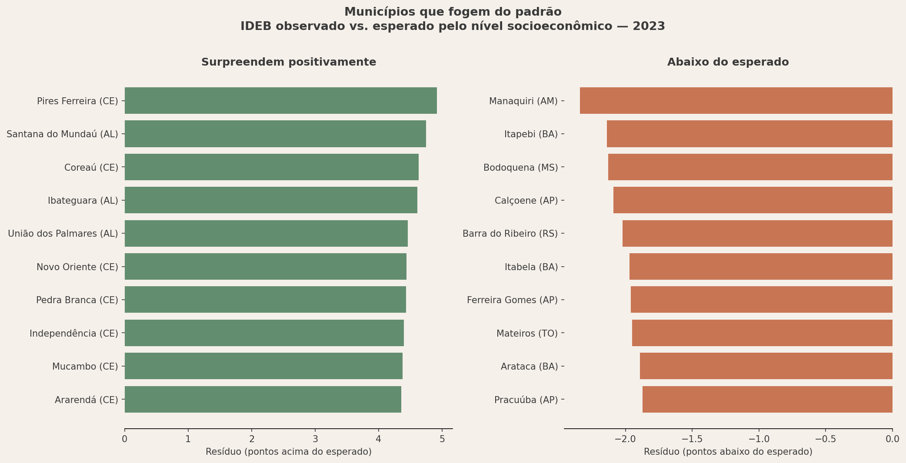
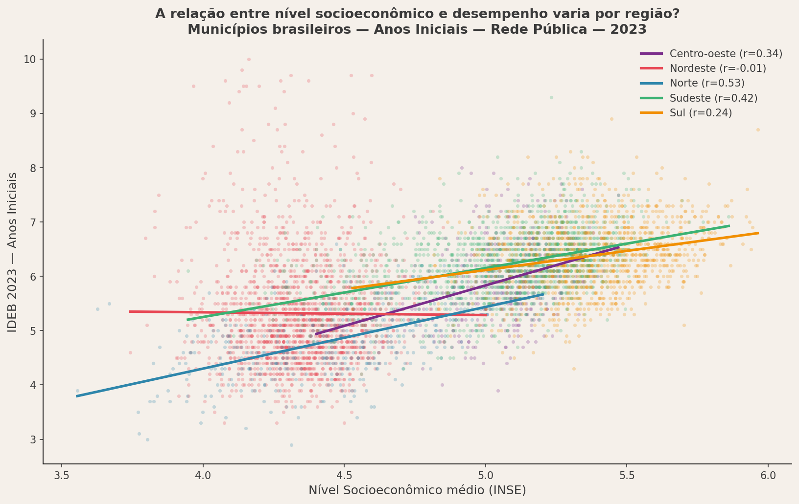

---

## Onde está o problema?

O mapa abaixo mostra o IDEB 2023 dos anos iniciais da rede pública por município. 
A desigualdade geográfica é imediata: Norte e Nordeste concentram os piores desempenhos, 
enquanto Sul e Sudeste lideram.

## Por que existe?

A correlação entre nível socioeconômico (INSE) e desempenho escolar (IDEB) é moderada-forte 
(r = 0.55). Municípios mais ricos tendem a ter melhores resultados — mas a relação não é 
determinista. Há municípios pobres com IDEB alto, e municípios ricos com IDEB baixo.

## Quem foge do padrão?

O mapa abaixo mostra o resíduo de cada município — a diferença entre o IDEB observado 
e o IDEB esperado dado o seu nível socioeconômico. Verde indica municípios que performam 
acima do esperado; vermelho, abaixo.

## O efeito varia por região?

Dentro do Nordeste, o INSE praticamente não explica o IDEB (r = -0.01) — municípios pobres 
e ricos performam de forma parecida. Isso é o efeito de políticas educacionais municipais 
como o PAIC no Ceará, que conseguiram quebrar a determinação socioeconômica. No Norte, 
a correlação é a mais forte (r = 0.53), sugerindo que políticas locais ainda não conseguiram 
fazer essa ruptura.

