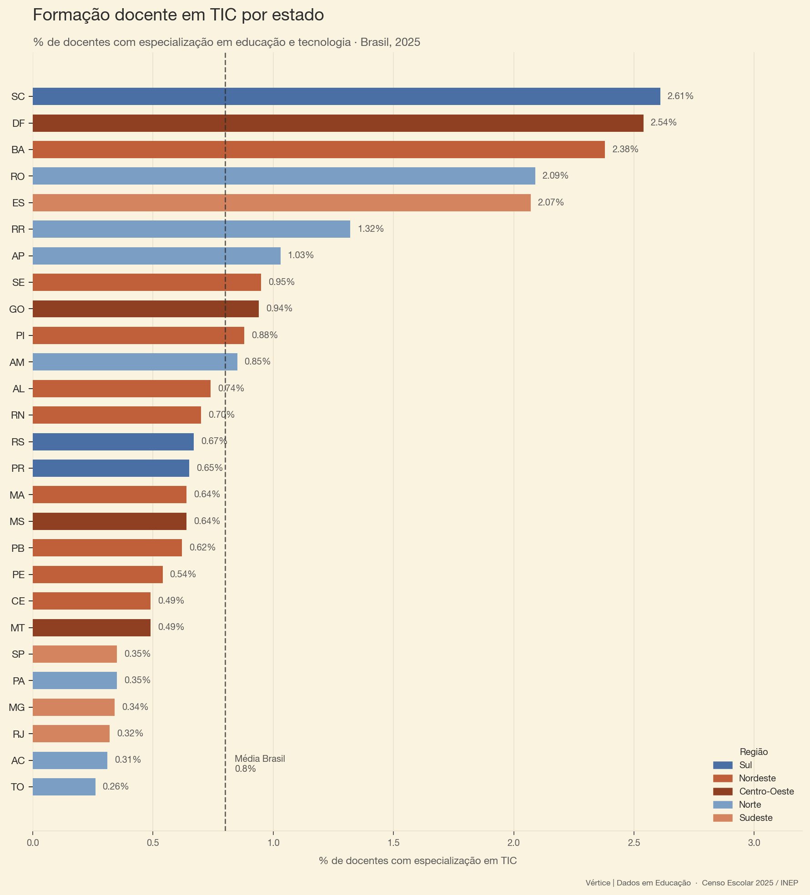
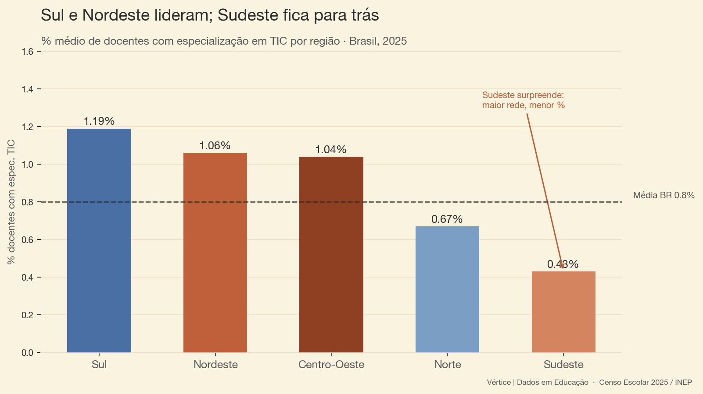
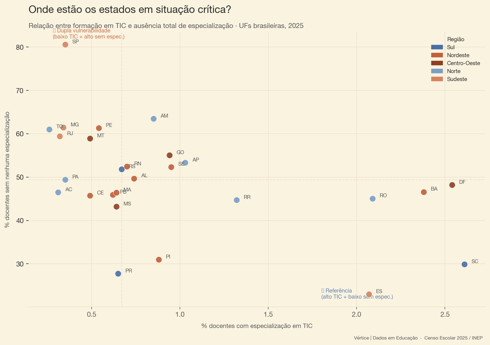

## Contexto

No cenário atual, em que estudantes chegam às salas de aula já imersos em inteligência 
artificial, redes sociais e ferramentas digitais, a formação docente em tecnologia deixou 
de ser diferencial para se tornar necessidade. Professores precisam não apenas usar 
ferramentas digitais, mas compreendê-las criticamente — para ensinar com elas, sobre 
elas e a partir delas. Sem formação específica, o risco é que a escola fique para trás 
numa transformação que já acontece fora dela.

Nesse cenário, mapear quem tem e quem não tem essa formação é o primeiro passo para 
orientar políticas públicas de desenvolvimento de competências digitais docentes.

**Dado central:** apenas **0,80%** dos professores brasileiros têm especialização em 
tecnologia educacional — um gap expressivo diante da crescente digitalização da educação 
pública.

## Formação em TIC por estado

O ranking revela uma desigualdade expressiva: Santa Catarina lidera com 2,61% — quase 
quatro vezes a média nacional de 0,8%. No extremo oposto, Tocantins registra apenas 0,26%. 
Chama atenção a presença de estados do Nordeste e Norte no topo — como Bahia (2,38%) e 
Rondônia (2,09%) — enquanto grandes redes do Sudeste, como São Paulo (0,35%), MG (0,34%) 
e RJ (0,32%), ficam bem abaixo da média nacional.

## Padrão regional

O recorte regional desfaz uma suposição comum: o Sudeste, maior e mais rico, fica em 
último lugar com apenas 0,43% — menos da metade da média nacional. O Sul lidera (1,19%), 
seguido de Nordeste (1,06%) e Centro-Oeste (1,04%). Isso sugere que o tamanho da rede 
não favorece necessariamente a especialização — ao contrário, pode diluí-la.

## Dupla vulnerabilidade

O scatter revela os estados em situação mais crítica: aqueles com baixa especialização 
em TIC **e** alto percentual de professores sem nenhuma especialização — uma vulnerabilidade 
dupla. São Paulo se destaca negativamente nesse quadrante: apesar do tamanho e dos recursos, 
combina baixa formação em TIC com altíssima proporção de docentes sem especialização alguma 
(80%). No quadrante oposto, referências como Espírito Santo e Santa Catarina mostram que 
é possível ter alta formação em TIC com baixa ausência de especialização.

## Fonte e metodologia

**Dados:** Censo Escolar 2025 — INEP  
**Ferramentas:** Python, pandas, matplotlib  
**Código:** [GitHub](https://github.com/BeatrizLobato/censo-escolar-2025-tic-docentes)